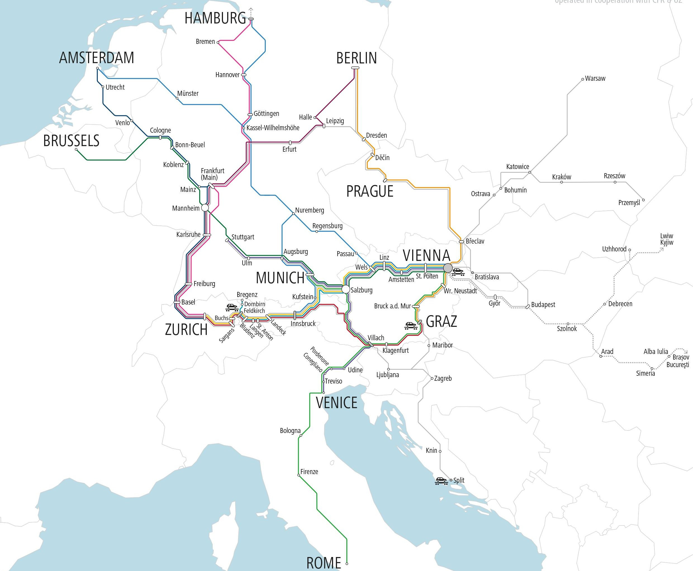

# Nightjet Route Planner

Nightjet Route Planner is a small Java console application for exploring simplified night train routes between European cities. It is inspired by the Nightjet network, but it does not use real timetables, bookings, delays, platform data, prices, or seat reservations.



> The image is used only as visual inspiration for this student project. It is not part of the route calculation logic.

## Overview

The application models a simplified train network:

- cities are vertices
- direct train connections are edges
- travel time in minutes is the edge weight

The program runs in a console menu and lets the user inspect the network, search routes, and sort connections.

## Features

- show all available cities
- show all train connections
- find the fastest route between two cities
- find a route with the fewest transfers
- sort all connections by travel time

## Algorithms

### Dijkstra's Algorithm

Used to find the fastest route between two cities. It works on weighted edges and returns the path with the smallest total travel time.

Example:

```text
Vienna -> Salzburg -> Munich
Total travel time: 300 minutes
```

### Breadth-First Search

Used to find a route with the fewest transfers. In this mode, travel time is ignored and every connection counts as one step.

Example:

```text
Venice -> Vienna -> Salzburg -> Munich -> Berlin
Transfers: 3
```

### Insertion Sort

Used to sort all train connections by travel time in ascending order.

Example:

```text
Linz <-> Salzburg | 80 min
Vienna <-> Linz | 100 min
Salzburg <-> Munich | 120 min
```

Insertion Sort was chosen because the data set is small and the implementation is easy to follow.

## Sample Data

The project ships with simplified sample data:

- 13 cities
- 16 undirected train connections

The data is enough to demonstrate the algorithms, but it is not a real route planner.

## Menu

When the application starts, it shows this menu:

```text
1. Show all cities
2. Show all train connections
3. Find fastest route
4. Find route with fewest transfers
5. Show connections sorted by travel time
6. Exit
```

## Technology

- Java 21
- Maven
- JUnit 5

## Project Structure

```text
src/
├── main/
│   └── java/
│       └── at/hcw/nightjet/
│           ├── Main.java
│           ├── app/
│           │   └── NightjetPlannerApp.java
│           ├── algorithm/
│           │   ├── BfsAlgorithm.java
│           │   ├── DijkstraAlgorithm.java
│           │   └── InsertionSort.java
│           ├── data/
│           │   └── SampleData.java
│           ├── graph/
│           │   └── NightjetGraph.java
│           └── model/
│               ├── City.java
│               ├── RouteResult.java
│               └── TrainConnection.java
└── test/
    └── java/
        └── at/hcw/nightjet/
            ├── algorithm/
            ├── graph/
            └── model/
```

## Run the Application

```bash
mvn exec:java
```

The main class is [at.hcw.nightjet.Main](src/main/java/at/hcw/nightjet/Main.java).

## Run the Tests

```bash
mvn test
```

## Notes

This project uses simplified sample data. It is inspired by real Nightjet destinations, but it does not represent official train schedules or booking information.